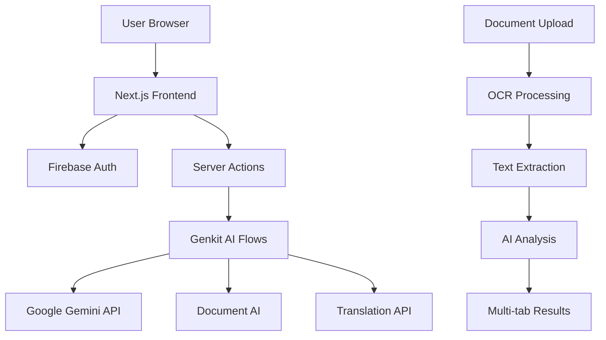

# 📄 ClarityDocs

[](https://nextjs.org/)
[](https://www.typescriptlang.org/)
[](https://firebase.google.com/)
[](https://ai.google.dev/)
[](https://tailwindcss.com/)

> **Transform complex documents into crystal-clear insights with AI-powered analysis**

ClarityDocs is an intelligent document analysis platform that uses advanced AI to break down complex legal documents, contracts, and agreements into simple, actionable insights. Get risk assessments, interactive timelines, negotiation suggestions, and plain-language explanations instantly.

## ✨ Key Features

### 🤖 **AI-Powered Document Analysis**
- **Smart Summarization**: Generates structured summaries with key points, Do's, and Don'ts
- **Risk Assessment**: Calculate risk scores (0-100) with detailed positive/negative breakdowns
- **Tone Analysis**: Identifies friendly, neutral, or strict language patterns in clauses

### 📊 **Interactive Insights**
- **Timeline Extraction**: Automatically identifies and visualizes key dates, deadlines, and milestones  
- **Scenario Analysis**: Interactive "What-if" chat to explore document implications
- **Term Definitions**: Click any highlighted term for instant plain-language explanations

### 🔍 **Smart Document Processing**
- **Multi-format Support**: Upload PDFs, images (JPG, PNG) with OCR extraction
- **Text Input**: Paste document content directly for instant analysis
- **Document Type Detection**: Optimized analysis for rentals, loans, employment contracts, ToS

### 💬 **Negotiation Intelligence**
- **Negotiation Suggestions**: AI-generated talking points for unfavorable clauses
- **Real-world Examples**: "In Simple Terms" explanations with practical scenarios
- **Multi-language Support**: Translate summaries to Hindi, Tamil, Telugu, Malayalam

### 🔐 **Secure & User-Friendly**
- **Firebase Authentication**: Secure user accounts and session management
- **Privacy-First**: Documents processed securely with no permanent storage
- **Responsive Design**: Beautiful, mobile-friendly interface with dark/light themes

## 🎯 Perfect For

- **Renters**: Understanding lease agreements and rental contracts
- **Employees**: Reviewing employment contracts and workplace policies  
- **Small Businesses**: Analyzing supplier agreements and service contracts
- **Consumers**: Decoding terms of service and privacy policies
- **Students**: Learning from legal document structures and language

## 🚀 Quick Start

### Prerequisites
- **Node.js** 18+ and npm/yarn
- **Google Cloud Account** with enabled APIs:
  - Gemini API
  - Document AI
  - Translation API
- **Firebase Project** with Authentication enabled

### Installation

1. **Clone the repository**
   ```bash
   git clone https://github.com/joe-anidas/ClarityDocs.git
   cd ClarityDocs
   ```

2. **Install dependencies**
   ```bash
   npm install
   # or
   yarn install
   ```

3. **Environment Setup**
   ```bash
   # Copy the environment template
   cp .env.example .env.local
   
   # Edit .env.local with your API keys
   nano .env.local
   ```

4. **Configure Environment Variables**
   ```env
   # Firebase API Key (client-side, public)
   NEXT_PUBLIC_FIREBASE_API_KEY=your_firebase_api_key
   
   # Server-side API Keys (keep these secure!)
   GOOGLE_CLOUD_API_KEY=your_google_cloud_api_key
   GEMINI_API_KEY=your_gemini_api_key
   
   # Google Cloud Project Settings
   GCLOUD_PROJECT=your_project_id
   DOCAI_PROCESSOR_ID=your_document_ai_processor_id  
   DOCAI_LOCATION=your_processor_location
   ```

5. **Start Development Server**
   ```bash
   npm run dev
   ```

6. **Launch Genkit Development UI** (optional)
   ```bash
   npm run genkit:dev
   ```

Visit `http://localhost:9002` to see your application!

## 🏗️ Architecture

### Tech Stack
- **Frontend**: Next.js 14 (App Router), React 18, TypeScript
- **Styling**: Tailwind CSS, shadcn/ui components
- **AI/ML**: Google Gemini API, Genkit AI orchestration
- **Cloud Services**: 
  - Firebase (Auth, Hosting)
  - Google Cloud Document AI (OCR)
  - Google Translate API
- **State Management**: React Context + Hooks
- **Form Handling**: React Hook Form + Zod validation

### System Architecture



### Component Flow

```
DocumentUpload → ClarityPage → SummaryView
     ↓               ↓            ↓
File/Text → Server Actions → AI Flows → Gemini API
     ↓               ↓            ↓
OCR Extract → Process → Results → Interactive UI
```

## 📁 Project Structure

```
src/
├── app/                    # Next.js App Router
│   ├── page.tsx           # Landing page
│   ├── clarity/           # Main app interface  
│   ├── sign-in/          # Authentication pages
│   └── sign-up/
├── components/
│   ├── auth/             # Authentication components
│   ├── clarity-docs/     # Core app components
│   │   ├── document-upload.tsx
│   │   ├── summary-view.tsx
│   │   ├── interactive-text.tsx
│   │   └── term-lookup-popover.tsx
│   ├── layout/           # Navigation & layout
│   └── ui/              # shadcn/ui components
├── ai/                   # AI orchestration layer
│   ├── flows/           # Genkit AI flows
│   │   ├── generate-plain-language-summary.ts
│   │   ├── generate-risk-score.ts
│   │   ├── generate-contract-timeline.ts
│   │   ├── answer-what-if-question.ts
│   │   └── lookup-term-definitions.ts
│   ├── genkit.ts        # AI configuration
│   └── dev.ts           # Genkit development server
├── lib/
│   ├── actions.ts       # Server actions
│   ├── firebase.ts      # Firebase configuration
│   └── utils.ts         # Utility functions
└── types/               # TypeScript definitions
```

## 🔧 Development

### Available Scripts

```bash
# Development server (port 9002)
npm run dev

# Genkit AI development UI
npm run genkit:dev
npm run genkit:watch

# Production build
npm run build

# Type checking
npm run typecheck

# Linting
npm run lint
```

### AI Flow Development

ClarityDocs uses **Genkit** for AI orchestration. Each analysis feature corresponds to a flow:

- `generate-plain-language-summary.ts` - Document summarization
- `generate-risk-score.ts` - Risk analysis with scoring
- `generate-contract-timeline.ts` - Date and deadline extraction
- `answer-what-if-question.ts` - Interactive Q&A
- `lookup-term-definitions.ts` - Legal term explanations

### Adding New Features

1. **Create AI Flow**: Add new flow in `src/ai/flows/`
2. **Server Action**: Export action in `src/lib/actions.ts`
3. **UI Component**: Add interface in `components/clarity-docs/`
4. **Integration**: Connect in `SummaryView.tsx`

## 🔐 Security Best Practices

### Environment Variables
- ✅ Use `NEXT_PUBLIC_` prefix for client-side variables only
- ✅ Keep server-side API keys in `.env.local` (never commit)
- ✅ Rotate API keys if exposed in git history
- ✅ Use Firebase Security Rules for data protection

### API Key Management
- **Firebase API Key**: Safe to expose (public by design)
- **Google Cloud API Keys**: Server-side only, restrict by IP/domain
- **Gemini API Key**: Server-side only, monitor usage quotas

## 🚀 Deployment

### Firebase App Hosting (Recommended)

1. **Install Firebase CLI**
   ```bash
   npm install -g firebase-tools
   firebase login
   ```

2. **Initialize Project**
   ```bash
   firebase init hosting
   ```

3. **Configure Environment**
   - Add production environment variables in Firebase Console
   - Ensure API keys have proper domain restrictions

4. **Deploy**
   ```bash
   npm run build
   firebase deploy
   ```

### Alternative Deployments

- **Vercel**: `vercel --prod`
- **Netlify**: Connect repository for auto-deployment
- **Google Cloud Run**: Containerized deployment

## 📊 Usage Analytics

Track key metrics to improve user experience:

- Document analysis completion rates
- Most used features (Risk Score, Timeline, etc.)
- API response times and error rates
- User retention and engagement patterns

## 🤝 Contributing

We welcome contributions! Please see our [Contributing Guide](CONTRIBUTING.md) for details.

### Development Workflow

1. **Fork the repository**
2. **Create feature branch**: `git checkout -b feature/amazing-feature`
3. **Make changes**: Follow TypeScript and ESLint conventions
4. **Test thoroughly**: Ensure all AI flows work correctly
5. **Submit PR**: Include description of changes and testing done

### Reporting Issues

- 🐛 **Bug Reports**: Include steps to reproduce, expected vs actual behavior
- 💡 **Feature Requests**: Describe use case and proposed solution
- 📚 **Documentation**: Help improve clarity and completeness

## 📄 License

This project is licensed under the **MIT License** - see the [LICENSE](LICENSE) file for details.

## 🙏 Acknowledgments

- **Google AI**: Gemini API for powerful language understanding
- **Firebase**: Authentication and hosting infrastructure  
- **shadcn/ui**: Beautiful, accessible component library
- **Genkit**: AI orchestration and development tools
- **Next.js**: Full-stack React framework
- **Tailwind CSS**: Utility-first styling approach

## 🔗 Links

- **Live Demo**: [claritydocs.example.com](#)
- **Documentation**: [docs.claritydocs.example.com](#)
- **Discord Community**: [Join our Discord](#)
- **Twitter**: [@ClarityDocs](#)

---

**Made with ❤️ for everyone who's ever been confused by legal jargon**

*Empowering users to understand documents and make informed decisions*